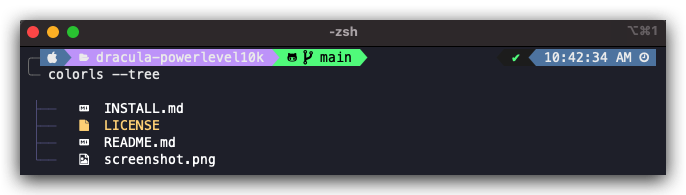

# Dracula for Powerlevel10k

> A dark theme for Oh My Zsh theme [Powerlevel10k](https://github.com/romkatv/powerlevel10k).

Pending Dracula PR: https://github.com/jseashell/dracula-powerlevel10k
## Install

All instructions can be found at [draculatheme.com/powerlevel10k](https://draculatheme.com/powerlevel10k).

1. Install [Dracula for iTerm](https://draculatheme.com/iterm)
1. Install [oh-my-zsh](https://github.com/ohmyzsh/ohmyzsh)
1. Install [powerlevel10k](https://github.com/romkatv/powerlevel10k)
1. Replace `~/.zshrc` with `./files/.zshrc`
1. Replace `~/.p10k.zsh` with `./files/.p10k.zsh`

## Team

This theme is maintained by the following person(s) and a bunch of [awesome contributors](https://github.com/dracula/template/graphs/contributors).

 |
--- |
[John Schellinger](https://github.com/jseashell) |

## License

[MIT License](./LICENSE)